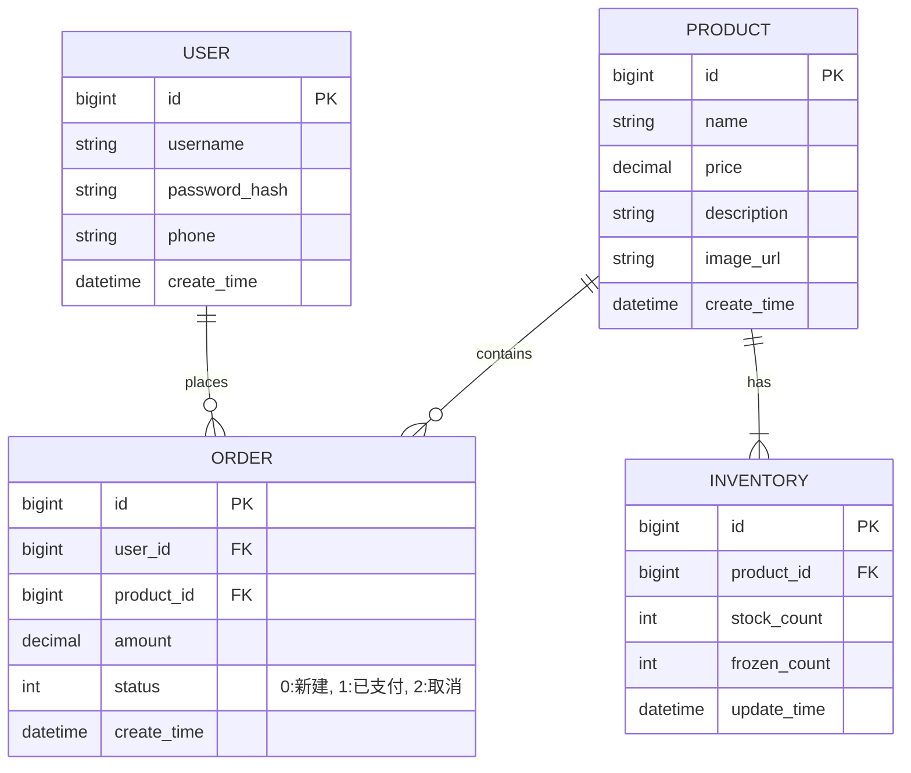

# 商品库存  与秒杀系统设计文档

## 1. 系统架构草图

### 服务拆分
系统采用微服务架构思想进行模块化拆分，分为以下核心服务模块：

1.  **用户服务 (User Service)**
    *   **职责**: 负责用户注册、登录、鉴权、个人信息管理。
    *   **关键功能**: JWT Token生成与验证、用户状态管理。
    *   **交互**: 其他服务需调用此服务验证用户身份。

2.  **商品服务 (Product Service)**
    *   **职责**: 商品信息的增删改查、商品列表展示、商品详情。
    *   **关键功能**: 商品上下架、分类管理。

3.  **库存服务 (Inventory Service / Stock Service)**
    *   **职责**: 维护商品库存数量，处理库存扣减、回滚。
    *   **关键功能**: 高并发下的库存一致性保障（Redis预减库存 + 数据库异步扣减）。

4.  **订单服务 (Order Service)**
    *   **职责**: 创建订单、订单状态流转（待支付、已支付、取消、完成）。
    *   **关键功能**: 秒杀订单生成、防重单。

### 架构示意
```mermaid
graph TD
    UserClient[客户端 (App/Web)] --> Gateway[API 网关 (Nginx/Gateway)]
    Gateway --> UserService[用户服务]
    Gateway --> ProductService[商品服务]
    Gateway --> OrderService[订单服务]
    Gateway --> InventoryService[库存服务]
    
    OrderService --> InventoryService[扣减库存]
    OrderService --> UserService[查询用户信息]
    ProductService --> InventoryService[查询库存]
    
    Redis[(Redis Cache)]
    MySQL[(MySQL DB)]
    MQ[消息队列 (RabbitMQ/Kafka)]
    
    UserService --> MySQL
    ProductService --> MySQL
    ProductService --> Redis
    InventoryService --> Redis
    InventoryService --> MySQL
    OrderService --> MySQL
    OrderService --下单成功消息--> MQ
    MQ --> InventoryService
```

## 2. API 接口定义 (RESTful)

### 用户服务
*   `POST /api/users/register`: 用户注册
*   `POST /api/users/login`: 用户登录
*   `GET /api/users/{id}`: 获取用户信息

### 商品服务
*   `GET /api/products`: 获取商品列表
*   `GET /api/products/{id}`: 获取商品详情

### 库存服务
*   `GET /api/inventory/{productId}`: 查询库存
*   `POST /api/inventory/deduct`: 扣减库存 (内部调用)

### 订单服务
*   `POST /api/orders/create`: 创建秒杀订单 (需登录)
*   `GET /api/orders/{id}`: 查询订单详情

## 3. 数据库 ER 图



## 4. 技术栈选型

*   **编程语言**: Java 17+ (LTS版本)
*   **核心框架**: Spring Boot 3.x (快速构建应用)
*   **ORM 框架**: MyBatis / MyBatis-Plus (灵活的SQL映射)
*   **数据库**: MySQL 8.0 (关系型数据存储)
*   **缓存**: Redis (热点数据缓存、分布式锁、库存预热)
*   **消息中间件**: RabbitMQ / RocketMQ (异步削峰、解耦订单与库存处理)
*   **API 文档**: Swagger / Knife4j
*   **构建工具**: Maven / Gradle
*   **版本控制**: Git

## 5. 环境准备清单

1.  **JDK 17**: 安装并配置环境变量 `JAVA_HOME`.
2.  **Maven 3.8+**: 安装并配置环境变量 `M2_HOME`.
3.  **MySQL 8.0**: 安装并创建数据库 `seckill`.
4.  **Redis**: 安装并启动 Redis 服务 (默认端口 6379).
5.  **Git**: 安装并配置用户信息.
6.  **IDE**: IntelliJ IDEA is recommended.
