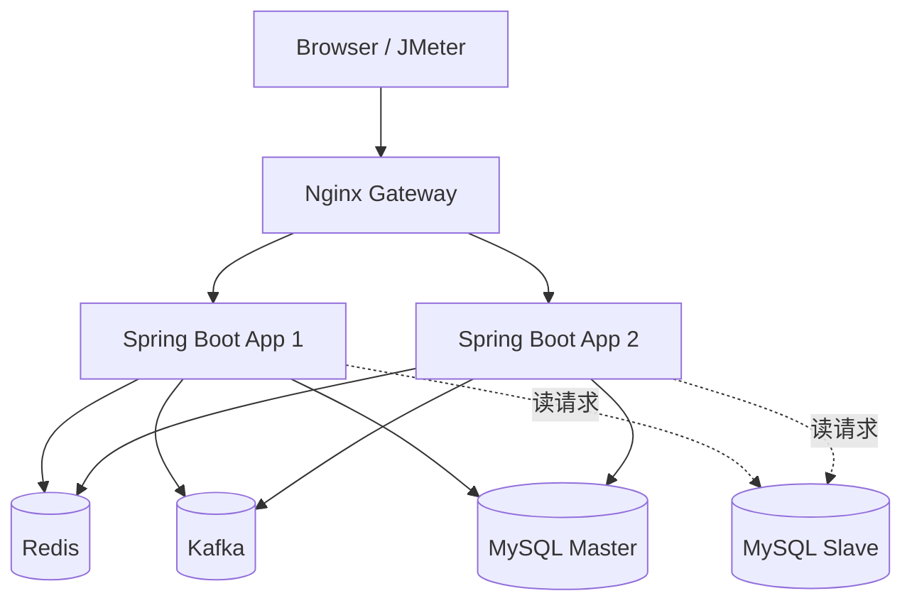
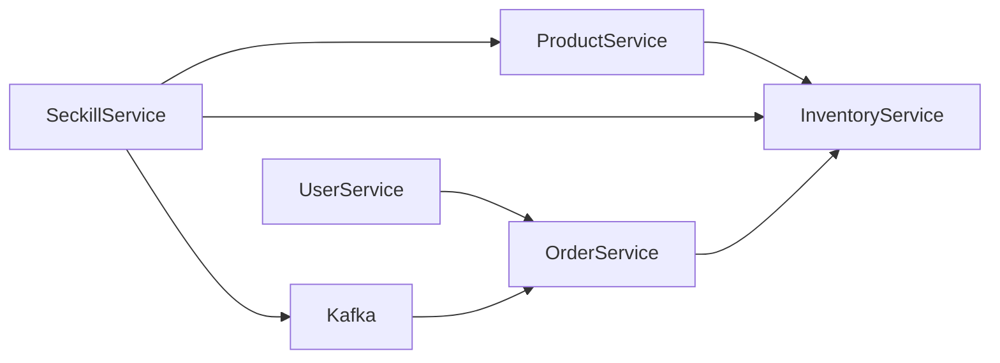
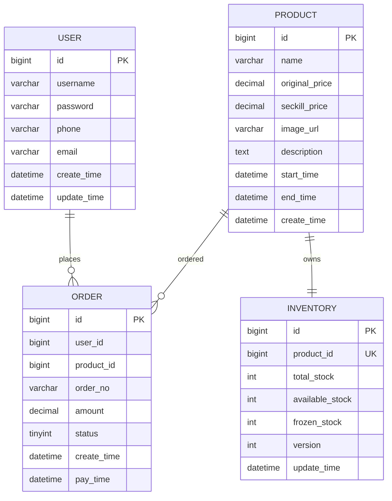

# 秒杀系统设计文档

## 1. 系统架构草图

### 1.1 服务拆分

- 用户服务 User Service：负责注册、登录、用户信息查询、登录态管理
- 商品服务 Product Service：负责商品列表、商品详情、商品搜索、商品详情缓存
- 库存服务 Inventory Service：负责库存查询、Redis 预减库存、数据库扣减库存
- 订单服务 Order Service：负责订单创建、订单查询、订单状态维护

### 1.2 架构图



### 1.3 模块职责关系



## 2. RESTful API 设计

### 2.1 用户服务

- `POST /api/users/register`
  请求体：`{ "username": "alice", "phone": "13900000000", "password": "password", "email": "a@b.com" }`
- `POST /api/users/login`
  请求体：`{ "phone": "13800000000", "password": "password" }`
- `GET /api/users/{id}`
- `GET /api/users/me`
  Header：`Authorization: Bearer <token>`

### 2.2 商品服务

- `GET /api/products`
- `GET /api/products?keyword=键盘`
- `GET /api/products/{id}`

### 2.3 库存服务

- `GET /api/inventory/{productId}`

### 2.4 订单服务

- `GET /api/orders/{id}`
- `GET /api/orders?userId=1`

### 2.5 秒杀服务

- `POST /api/seckill/{productId}`
  Header：`Authorization: Bearer <token>`
- `GET /api/seckill/status/{orderId}`

## 3. 数据库 ER 图



## 4. 技术栈选型说明

### 4.1 编程语言与框架

- Java 17：LTS 版本，生态成熟
- Spring Boot 3.2：快速构建 REST 服务
- MyBatis：SQL 可控，便于展示事务、库存扣减和读写分离

### 4.2 中间件

- MySQL 8.0：核心业务数据
- Redis：缓存商品详情、存储登录 Token、预扣库存
- Kafka：异步创建订单，削峰填谷
- Nginx：反向代理、负载均衡、动静分离

### 4.3 选型原因

- Redis 适合高并发热点商品缓存和库存预减
- Kafka 适合将下单请求异步化，降低瞬时数据库压力
- MySQL 主从适合作业中的读写分离演示
- Nginx 配置简单，便于演示轮询、最少连接和 IP Hash

## 5. 关键设计说明

### 5.1 商品详情缓存

- Cache Aside 模式
- 缓存穿透：空对象短 TTL 缓存
- 缓存击穿：互斥锁重建缓存
- 缓存雪崩：基础 TTL + 随机抖动

### 5.2 秒杀下单

1. 用户登录后携带 Token 发起秒杀请求
2. Redis 使用 `SETNX` 标记同一用户同一商品是否已抢购
3. Redis 对库存键执行 `DECR` 预扣库存
4. 生成雪花订单 ID，发送 Kafka 消息
5. 消费端在事务中写入订单、扣减数据库库存
6. 若库存不足或处理失败，执行补偿并回滚 Redis 标记

### 5.3 幂等性

- Redis 重复购买标记
- 订单表唯一索引：`(user_id, product_id)`

### 5.4 数据一致性

- Redis 只做预减和快速限流
- 最终扣库存以数据库原子更新为准
- 异步消费失败时执行库存回补与去重标记释放

### 5.5 读写分离

- 写请求默认走主库
- 读请求通过 `@ReadOnlyDataSource` 切换到从库
- 使用 `AbstractRoutingDataSource` 在运行期动态选择数据源

## 6. 环境准备

- JDK 17
- Maven 3.8+
- Docker / Docker Compose
- JMeter

## 7. 负载均衡与动静分离

### 7.1 负载均衡

Nginx upstream 当前默认使用轮询：

```nginx
upstream seckill_backend {
    server seckill-app-1:8080 weight=1;
    server seckill-app-2:8080 weight=1;
}
```

可切换为：

- `least_conn;`
- `ip_hash;`

### 7.2 动静分离

- `/` 与 `/assets/**`：Nginx 直接返回静态资源
- `/api/**`：代理到后端集群

## 8. 可选扩展

### 8.1 ElasticSearch 商品搜索

作业中为可选项。当前项目保留了 `/api/products?keyword=` 的搜索接口，默认用 MySQL `LIKE` 实现；如果要升级为 ElasticSearch，可在商品服务中增加索引同步与查询适配层。

### 8.2 分库分表

作业中为选做项。可进一步引入 ShardingSphere-JDBC：

- 按用户 ID 分库
- 按订单 ID 分表

当前代码已使用雪花算法生成订单 ID，便于后续接入分片规则。
